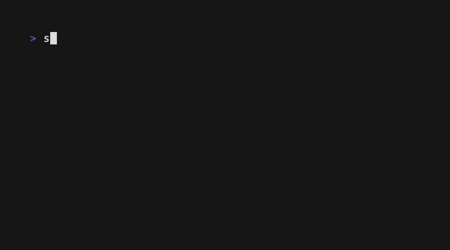

# sshbox

[](go.mod)
[](https://github.com/kknxzz/sshbox/releases)
[](LICENSE)

SSH into a fresh Docker container. Every connection gets a new Alpine shell; disconnect and the container is gone.

<table align="center">
<tr>
<td width="50%" align="center">
<br>
<sub>disconnect, and the container is gone</sub>
</td>
<td width="50%" align="center">
<br>
<sub>a real pty -- history and vi work, not just piped text</sub>
</td>
</tr>
</table>

It's a single static binary and one TOML file. Point it at a Docker socket and it works.

## Why

Give it to a friend, a co-worker, or just test something out in a disposable environment -- they get a real Alpine box, and it's gone the moment they disconnect, nothing left running that you forgot about.

Handy for home-server setups too: point people at it and they get instant Linux access, no real account and no container to remember to clean up afterward.

## Security model

sshbox accepts any username and password -- authentication is left to whatever sits in front of it (Tailscale, a VPN, a bastion). Don't expose port 2222 straight to the internet.

Every connection gets its own container: nothing from the host mounted in, no network access by default, capped at 256MB memory and half a CPU, killed the moment you disconnect. That isolates sessions from each other and from the host, but it's not a hardened sandbox against someone actively trying to break out.

<p align="center">
<br>
<sub><code>rm -rf /</code> inside the container -- disconnect, reconnect, like it never happened</sub>
</p>

## Getting started

Install Go and Docker:

```
# macOS
brew install go
brew install --cask docker

# Linux
sudo apt install golang-go # or your distro's package manager
curl -fsSL https://get.docker.com | sh

# Windows
winget install GoLang.Go
winget install Docker.DockerDesktop
```

Clone and run (Docker needs to actually be running -- `docker info` should succeed):

```
git clone https://github.com/kknxzz/sshbox
cd sshbox
go run .
```

or `go build && ./sshbox`. Once it logs `listening addr=:2222 ...`, connect from another terminal:

```
ssh -p 2222 anyone@localhost
```

Any username and password gets in. Exit or disconnect and the container is destroyed -- `docker ps -a` won't show it.

## Config

sshbox reads `config.toml` from the current directory by default. Every field has a matching flag that overrides the file if passed; point at a different file with `--config path/to/file.toml`.

| Field | Flag | Default | Meaning |
|-------|------|---------|---------|
| `listen_addr` | `--listen` | `:2222` | address the SSH server binds to |
| `image` | `--image` | `alpine:latest` | image to run per session |
| `shell` | `--shell` | `/bin/sh` | command run inside the container |
| `network` | `--network` | `none` | Docker network mode |
| `memory` | `--memory` | `256m` | Docker memory limit |
| `cpus` | `--cpus` | `0.5` | Docker CPU limit |
| `idle_timeout` | `--idle-timeout` | `10m` | disconnect after this long with no activity |
| `host_key_path` | `--host-key` | `host_key` | where the ssh host key is stored, generated on first run |
| `runtime` | `--runtime` | `docker` | container runtime binary -- `docker` or `podman` |

## Limitations

- No authentication -- see Security model above.
- Single node only, no clustering, no remote Docker hosts.
- No persistent storage -- nothing carries between sessions.
- No SFTP, SCP, or port forwarding.
- No Docker Compose -- one image, one container, per session.
- Linux containers only.
- `alpine:latest` is barebones -- no curl, no sudo, no bash, just busybox and `apk`. `apk add curl` works fine manually, it just doesn't persist. Point `image` at something fuller if that's annoying.
- PTY support covers normal interactive shells: colors, resize, history. Full-screen apps with unusual escape sequences aren't tested exhaustively.

## Contributing

PRs welcome -- see [CONTRIBUTING.md](CONTRIBUTING.md) for style notes. Issues labeled `good-first-issue` are a good place to start. Star it if you find it useful.

## License

MIT
